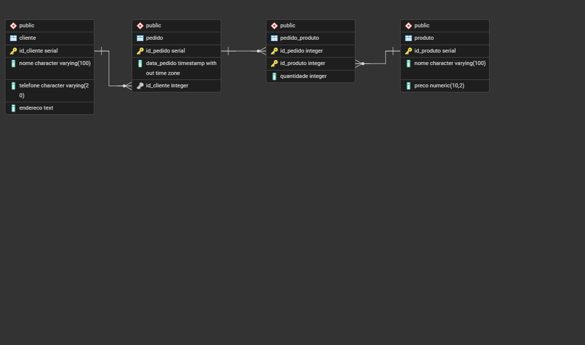

# Backend Pizzaria

API REST desenvolvida em Python utilizando Flask e PostgreSQL para gerenciamento de clientes, produtos e pedidos de uma pizzaria.

## Tecnologias utilizadas

* Python 3
* Flask
* PostgreSQL
* Psycopg2
* Dotenv
* Postman (testes)

## Funcionalidades

### Clientes

* Criar cliente
* Listar clientes
* Buscar cliente por ID
* Atualizar cliente
* Excluir cliente

### Produtos

* Criar produto
* Listar produtos
* Buscar produto por ID
* Atualizar produto
* Excluir produto

### Pedidos

* Criar pedido
* Buscar pedido completo
* Adicionar produto ao pedido
* Atualizar quantidade de um produto no pedido
* Remover produto do pedido
* Calcular total do pedido

## Estrutura do banco de dados

### Cliente

| Campo      | Tipo    |
| ---------- | ------- |
| id_cliente | SERIAL  |
| nome       | VARCHAR |
| telefone   | VARCHAR |
| endereco   | VARCHAR |

### Produto

| Campo      | Tipo    |
| ---------- | ------- |
| id_produto | SERIAL  |
| nome       | VARCHAR |
| preco      | NUMERIC |

### Pedido

| Campo       | Tipo      |
| ----------- | --------- |
| id_pedido   | SERIAL    |
| data_pedido | TIMESTAMP |
| id_cliente  | INTEGER   |

### Pedido_Produto

| Campo      | Tipo    |
| ---------- | ------- |
| id_pedido  | INTEGER |
| id_produto | INTEGER |
| quantidade | INTEGER |

## Modelo do Banco de Dados



## Exemplos de requisições

### Criar cliente

POST /clientes

```json
{
    "nome": "João Silva",
    "telefone": "11999999999",
    "endereco": "Rua A, 123"
}
```

### Criar produto

POST /produtos

```json
{
    "nome": "Pizza Calabresa",
    "preco": 45.90
}
```

### Criar pedido

POST /pedidos

```json
{
    "id_cliente": 1
}
```

### Adicionar produto ao pedido

POST /pedidos/1/produtos/2

```json
{
    "quantidade": 2
}
```

## Como executar o projeto

1. Clone o repositório
2. Crie um ambiente virtual
3. Instale as dependências
4. Configure o arquivo .env
5. Execute a aplicação

```bash
pip install -r requirements.txt
python app.py
```

## Autor

Isaac Matheus Novais
